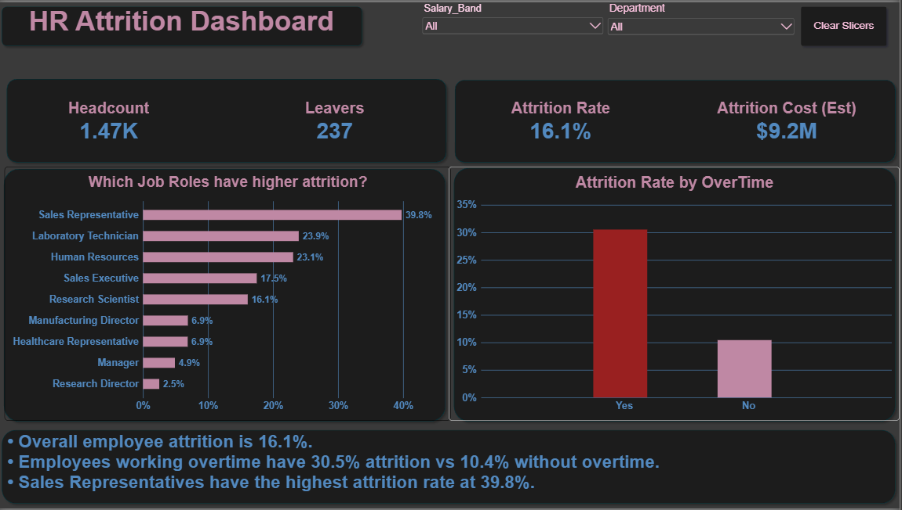
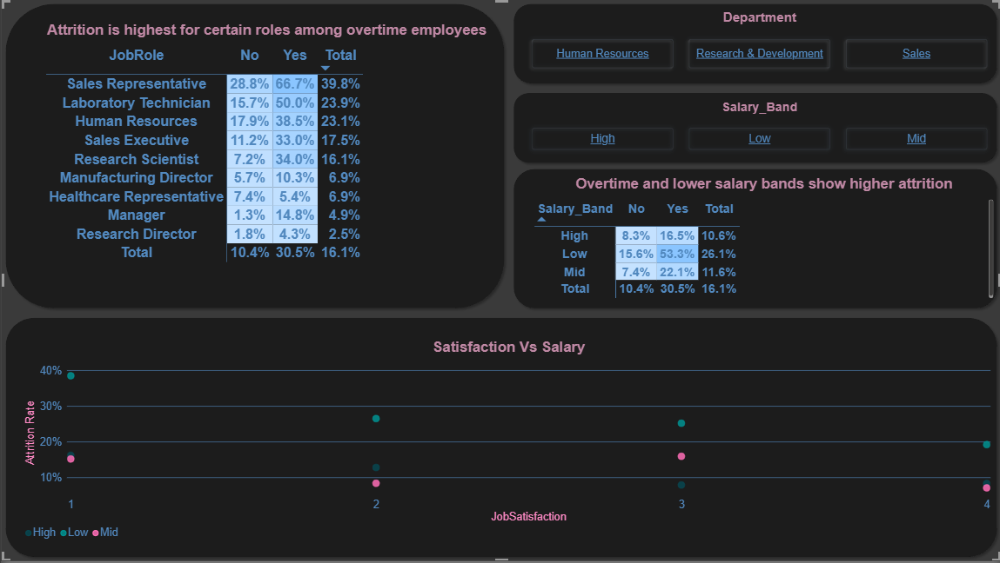
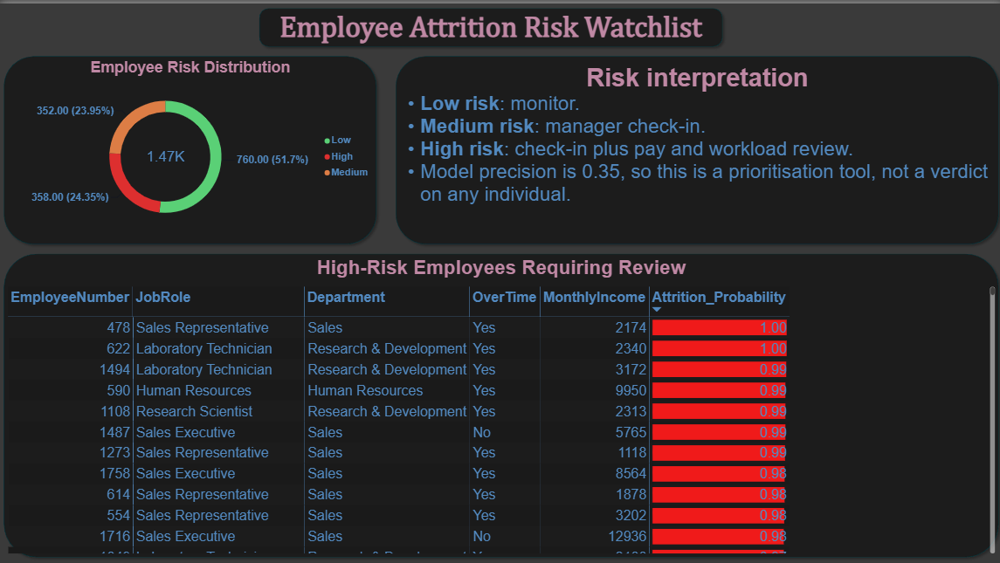

# HR Analytics — Employee Attrition Analyzer

An end-to-end HR analytics project that explores employee attrition patterns, builds a machine learning model to predict attrition, generates employee-level risk scores, and presents the findings through an interactive Power BI dashboard.

---

## 📊 Project Overview

Employee attrition can affect productivity, workforce stability, and hiring costs. This project analyzes the **IBM HR Analytics Employee Attrition & Performance dataset** to understand the factors associated with employee turnover and identify employees who may warrant further HR review.

The project follows an end-to-end analytics workflow:

**Data Cleaning → Exploratory Data Analysis → Machine Learning → Risk Scoring → Power BI Dashboard**

---

## 💡 Why I Built This

During my HR and Digital Marketing internship at **Partnerdesk**, I worked with and coordinated international interns and gained practical exposure to employee coordination and HR-related activities.

That experience made me interested in understanding employee behavior through data.

I built this project to combine my **HR experience with my data analytics and machine learning skills** and explore how data can help HR teams identify patterns associated with employee attrition.

---

## 🎯 Objectives

* Analyze overall employee attrition.
* Identify departments and job roles with higher attrition.
* Examine the relationship between overtime, salary, satisfaction, and attrition.
* Build a machine learning model to predict employee attrition.
* Generate an attrition probability for every employee.
* Categorize employees into Low, Medium, and High risk levels.
* Build an interactive Power BI dashboard for HR-focused analysis.
* Present model predictions as a prioritization tool rather than a definitive judgment about individual employees.

---

## 📂 Dataset

**IBM HR Analytics Employee Attrition & Performance Dataset**

The dataset contains:

* **1,470 employees**
* **35 features**
* Employee demographics
* Department and job role
* Monthly income
* Job satisfaction
* Environment satisfaction
* Work-life balance
* Overtime
* Years at company
* Total working years
* Attrition status

Target variable:

```text
Attrition
Yes = Employee left
No  = Employee stayed
```

---

# 🔎 Exploratory Data Analysis

The project explores employee attrition across multiple dimensions, including:

* Department
* Job Role
* Overtime
* Salary
* Job Satisfaction
* Work-Life Balance
* Years at Company
* Total Working Years
* Employee demographics

### Key Findings

* Overall attrition rate: **16.1%**
* Employees working overtime have a **30.5% attrition rate**, compared with **10.4%** for employees not working overtime.
* **Sales Representatives** have the highest attrition rate among job roles at approximately **39.8%**.
* Salary, overtime, satisfaction, and workload-related factors show meaningful differences in attrition patterns.

---

# 🤖 Machine Learning

The project uses machine learning to predict whether an employee is likely to leave.

### Models Evaluated

* Logistic Regression
* Random Forest

### Model Performance

| Model               | Accuracy | Precision | Recall | F1 Score |  ROC-AUC |
| ------------------- | -------: | --------: | -----: | -------: | -------: |
| Logistic Regression |     0.75 |      0.35 |   0.62 |     0.44 | **0.80** |
| Random Forest       |     0.83 |      0.47 |   0.38 |     0.42 |     0.78 |

Logistic Regression was selected as the primary model for the risk-scoring workflow because it achieved higher recall and ROC-AUC on the held-out test set.

Because employee attrition is an imbalanced classification problem, accuracy alone is not sufficient for evaluating the model. Precision, recall, F1 score, and ROC-AUC are also considered.

---

# ⚠️ Employee Risk Scoring

For the Power BI dashboard, employee-level attrition probabilities are generated using **5-fold stratified out-of-fold predictions**.

This means each employee receives a prediction from a model that **did not train on that employee's data**.

Employees are grouped into three risk levels:

| Risk Level | Employees | Actual Attrition |
| ---------- | --------: | ---------------: |
| 🟢 Low     |       760 |             3.9% |
| 🟠 Medium  |       352 |            16.2% |
| 🔴 High    |       358 |            41.9% |

The High-risk group represents approximately **24.4% of employees** but contains approximately **63.3% of all observed leavers**.

These risk levels are intended to help prioritize areas for further investigation and are **not definitive judgments about individual employees**.

---

# 📊 Power BI Dashboard

The project includes a three-page interactive Power BI dashboard.

## 1. Overview

Provides a high-level summary of:

* Headcount
* Number of leavers
* Attrition rate
* Estimated attrition cost
* Job-role attrition
* Overtime vs attrition
* Department and salary-band filters



---

## 2. Where & Why

Explores potential relationships between:

* Job Role
* Overtime
* Salary Band
* Job Satisfaction
* Attrition Rate

The page includes heatmaps and comparative visualizations to help identify patterns across employee groups.



---

## 3. Risk Watchlist

Provides:

* Low / Medium / High risk distribution
* High-risk employee watchlist
* Employee job role and department
* Overtime status
* Monthly income
* Attrition probability

The watchlist is designed as a **prioritization tool for further HR review**, rather than an automated decision-making system.



---

# 🧮 Estimated Attrition Cost

The dashboard includes an estimated attrition cost based on the following simplified assumption:

```text
Estimated Cost =
Number of Leavers
× Average Monthly Income
× 12
× 50%
```

The 50% factor is an illustrative replacement-cost assumption and should not be interpreted as an actual company-specific cost.

---

# 🛠️ Technologies Used

### Programming & Data Analysis

* Python
* Pandas
* NumPy

### Data Visualization

* Matplotlib
* Seaborn
* Power BI

### Machine Learning

* Scikit-learn
* Logistic Regression
* Random Forest
* Stratified Cross-Validation
* Out-of-Fold Prediction

### Development

* Jupyter Notebook
* VS Code
* Git
* GitHub

---

# 📁 Project Structure

```text
HR_Attrition_Analyzer/
│
├── 01_eda.py
├── 02_model.py
├── 03_heatmap_dashboard.py
├── 04_powerbi_export.py
│
├── hr_attrition_raw.csv
├── hr_clean.csv
├── hr_powerbi.csv
├── employee_risk_scores.csv
│
├── plot_overall_attrition.png
├── plot_dept_attrition.png
├── plot_overtime_attrition.png
├── plot_salary_overtime_combo.png
├── plot_salary_satisfaction.png
├── plot_salary_satisfaction_workload.png
├── plot_department_jobrole_heatmap.png
├── plot_correlation_heatmap.png
├── plot_feature_importance.png
├── plot_confusion_matrix.png
│
├── PowerBI/
│   ├── HR_Attrition_Dashboard.pbix
│   └── Screenshots/
│       ├── page1_overview.png
│       ├── page2_where_why.png
│       └── page3_watchlist.png
│
└── README.md
```

---

# 📄 File Descriptions

| File                                  | Description                                                                    |
| ------------------------------------- | ------------------------------------------------------------------------------ |
| `01_eda.py`                           | Data cleaning and exploratory analysis                                         |
| `02_model.py`                         | Machine learning model training and evaluation                                 |
| `03_heatmap_dashboard.py`             | Python-based attrition pattern visualizations                                  |
| `04_powerbi_export.py`                | Generates out-of-fold employee attrition probabilities and Power BI-ready data |
| `hr_attrition_raw.csv`                | Original HR dataset                                                            |
| `hr_clean.csv`                        | Cleaned dataset used for analysis                                              |
| `employee_risk_scores.csv`            | Model-generated employee risk scores from the modeling workflow                |
| `hr_powerbi.csv`                      | Final employee-level dataset used by the Power BI dashboard                    |
| `powerbi/HR_Attrition_Dashboard.pbix` | Interactive Power BI dashboard                                                 |
| `plot_*.png`                          | Supporting Python EDA visualizations                                           |

---

# ⚠️ Model Limitations

The model should be treated as a **decision-support and prioritization tool**, not as a system for making decisions about individual employees.

The primary Logistic Regression model achieved a precision of **0.35** on the held-out test set. This means many employees flagged as potential leavers would not actually leave.

Other limitations include:

* The dataset is relatively small at 1,470 employees.
* The dataset represents a specific HR dataset rather than a real organization's current workforce.
* Risk thresholds are illustrative and may require recalibration for another organization.
* Correlation and model importance do not necessarily imply causation.
* Predictions should be interpreted alongside HR context and human judgment.

---

# 🚀 Future Improvements

Potential extensions include:

* Experiment with XGBoost or LightGBM.
* Perform hyperparameter tuning using GridSearchCV.
* Calibrate predicted probabilities.
* Optimize the classification threshold based on the HR use case.
* Add model explainability using SHAP.
* Build a Streamlit application for interactive employee risk scoring.
* Add additional HR datasets for external validation.
* Monitor model performance when applied to new data.

---

# 👨‍💻 Author

**Aakarshit Pathak**

BCA Graduate — University of Lucknow

Interested in **Data Science, Data Analytics, Machine Learning, and using technology to solve real-world problems.**

### Connect

* GitHub: `github.com/aakarshitpathak`
* LinkedIn: `linkedin.com/in/aakarshit-p-501605264/`
